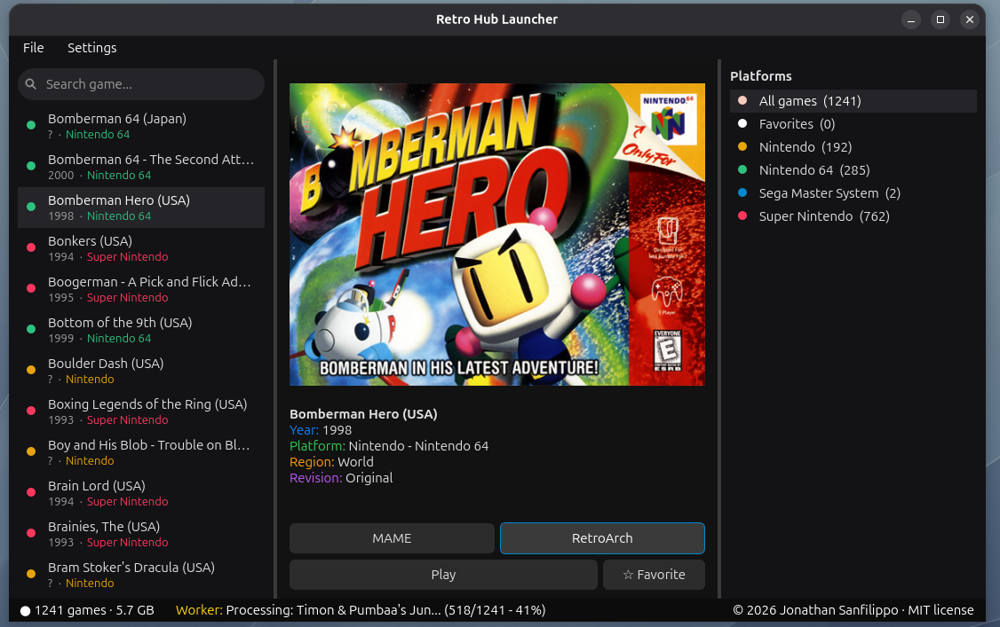

# Retro Hub Launcher

A professional, high-performance desktop frontend designed to manage and launch retro gaming ROMs. Written in Python utilizing PySide6 (Qt6) and Pygame, it features asynchronous background workers, multi-platform automated organization, native gamepad navigation, and robust dual-backend emulator integration (RetroArch and MAME).

Specifically engineered and optimized for Debian 13 (Trixie) running strictly on an X11 / Xorg display server environment.

---

## 1. Complete System Dependencies & Environment Setup (Debian 13 / X11)

To run this application without rendering or input errors, execute the following command in your terminal to install all mandatory system packages, build tools, X11 utilities, and joystick drivers:

sudo apt update && sudo apt install -y \
    python3 \
    python3-pip \
    python3-venv \
    python3-pyside6 \
    python3-pygame \
    flatpak \
    x11-utils \
    libgl1-mesa-dri \
    libgl1-mesa-glx \
    joystick \
    udev

---

## 2. Python Libraries Requirements

The application relies on the following Python packages (automatically satisfied if installed via APT as shown above, or via pip):
* PySide6 (>= 6.5.0) - Graphical user interface framework (Qt6 bindings).
* Pygame (>= 2.1.0) - Low-level event handling and hardware subsystem hooks.
* Built-in Python 3.10+ modules: os, sys, json, subprocess, threading, glob, hashlib, struct, select, time, re, html.

---

## 3. Emulator Backends & Runtimes

The application integrates with both Flatpak and native package managers. For Debian 13 on X11, Flatpak is recommended for the latest stable emulator cores:

* RetroArch (Flatpak):
  flatpak install flathub org.libretro.RetroArch

  Required Libretro Cores (managed via RetroArch online core updater):
  - snes9x_libretro.so (Super Nintendo / SNES)
  - fceumm_libretro.so (Nintendo NES)
  - genesis_plus_gx_libretro.so (Sega Mega Drive / Master System)
  - gambatte_libretro.so (Game Boy / Game Boy Color)
  - vba_next_libretro.so (Game Boy Advance)
  - mupen64plus_next_libretro.so (Nintendo 64)

* MAME (Flatpak):
  flatpak install flathub org.mamedev.MAME

---

## 4. Environment & Hardware Prerequisites (Debian 13 / X11)

* Display Server: Must run under an Xorg/X11 session. Wayland is intentionally avoided due to window layering and rendering incompatibilities with legacy frontend architecture.
* Gamepad Permissions: The background input thread polls /dev/input/js*. Ensure your user account belongs to the input group:
  sudo usermod -aG input $USER
  (Log out and log back in for changes to apply).

---

## 5. Project Directory Structure

sms_launcher/
├── launcher.py        # Main graphical user interface (PySide6)
├── worker.py          # Background asynchronous metadata & asset scraper
├── roms/              # Root directory for your game ROM collections
├── bios/              # Mandatory system BIOS files for MAME / Arcade titles
└── import/            # Watch folder for automatic ROM ingestion

---

## 6. Quick Start Guide

1. Ensure all system packages and dependencies listed in Section 1 are installed.
2. Place your ROM files inside the roms/ directory.
3. Place required system BIOS files (e.g., neogeo.zip) inside the bios/ directory.
4. Run the launcher:
   python3 launcher.py
